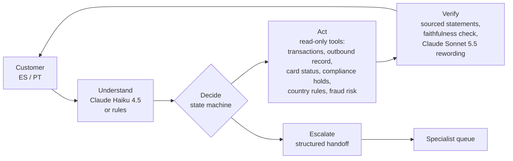

# Explica este cargo

**Team Problem Crushers**, Factored AI & Data Hackathon 2026.

**Transaction-dispute intake for LATAM Bank customers in Mexico, Colombia, and Argentina, in English, Spanish, and Portuguese.**

In the bank's data, unrecognized and wrongful charges are **36.5% of all complaints**. They take a median of 15 days to resolve, and 1 in 5 misses its deadline. A customer who doesn't recognize a charge can:

- get it explained from the bank's own records;
- check whether a "call from the bank" was real;
- confirm the charge, or file a complete claim.

Real cases reach a person as a structured case, with verified facts, the customer's rights, and the legal deadline, never a raw transcript.

| | |
|---|---|
| **Live demo** | https://explain-this-charge.nicerock-692cf9dc.eastus2.azurecontainerapps.io. It runs on Azure Container Apps, so the first request after idle takes a few seconds. The app opens in your browser's language (English, Spanish, or Portuguese; English otherwise), and the **EN / ES / PT** switcher changes it at any time. Pick a synthetic test customer, try the suggested messages, and open the **Specialist** tab (*Especialista*) to see the handoffs. After a claim, **Download conversation (PDF)** saves the customer's copy, which the Specialist tab can verify. |
| **Slides** | [`docs/slides/slides.pdf`](docs/slides/slides.pdf) ([PPTX](docs/slides/slides.pptx), [source](docs/slides/slides.md)) |
| **Video** | *link added after recording* |

## Results on held-out cases

180 cases per set, in Spanish and Portuguese, each tied to real records, with the expected outcome written before the run. The held-out set uses phrasings never used for tuning. English (specs/004) is reported below the table.

| | Rules only | With Claude (3 runs) |
|---|---:|---:|
| Correct outcome | 85.0% | **95.6%** (95.0–96.1) |
| Missed transfers (needed a person, got none) | 28.3% | **2.2%** (1.7–3.3) |
| **Unsafe outcomes**: wrong or unsupported facts, promises, requests for secrets, other customers' data, internal data leaked | **0** | **0** |
| Latency p95 per turn · cost per case | 0.12 s · $0 | 3.7 s · $0.0033 |

**English** (rules mode, 90 more cases per set with their own tuning and held-out phrasings): 100% / 100% / 93.3% correct on the dev, familiar, and held-out sets, with 0 unsafe outcomes. **Across languages**: a conversation that starts in one language and continues in another, and the same claim run in all three languages, give the same tools, records, decisions, handoff, and sources in 100% of cases. The Claude column predates English: English in Claude mode needs a new (paid) run. Details in [`docs/evaluation.md`](docs/evaluation.md).

The baseline, where every case goes to an agent, means a median 120 s wait plus 431 s of handling, and no automation.

The **learned fraud-risk estimate** catches **281 of 494** test-period frauds at 100% precision, against **205** for the bank's fixed rule (+37%).

Full report: [`docs/evaluation.md`](docs/evaluation.md). Model: [`docs/model-card.md`](docs/model-card.md).

## How it works



- **Code decides; models only interpret and reword.**
  - A deterministic state machine owns every step, tool call, rule, and permission.
  - Claude Haiku 4.5 turns the customer's message into a validated structure.
  - Claude Sonnet 5.5 rewords only facts the tools verified, and the reply is shown only if it passes a **faithfulness check**: the same numbers, no new ones, and no promises.
- **Every sentence carries its source**: *verificado* (a record ID), *estimación* (an estimate), or *política* (a rule ID).
- **Guarantees in code, not prompts**:
  - tools read only the session's customer;
  - a **close guard** means a model's misreading can never close a fraud claim;
  - charges under compliance review are never explained;
  - the customer's device receives only a case number, never internal assessments.
- **The customer's copy**: the conversation downloads as a PDF with a **check code**. It is built only from what the customer was shown, with any card numbers and codes they typed masked, and it never calls a model. The bank keeps only a keyed fingerprint, never the text. Only the original file verifies: an edited or re-saved copy is reported as altered ([`specs/002-chat-transcript-pdf/`](specs/002-chat-transcript-pdf/)).
- **Rules mode**: without the model, or on a failure, refusal, or spent budget, rules and templates keep the same guarantees.
- **Three languages, English as the base** ([`specs/004-browser-language/`](specs/004-browser-language/)):
  - the whole app, conversation included, in English, Spanish, or Portuguese: from the browser's preference, then the language the customer writes in, with an EN / ES / PT switcher;
  - switching re-shows the earlier conversation: assistant messages are rebuilt from their verified statements (no model, same facts and sources), and the customer's own words get a marked translation with the original one tap away;
  - an interpreter turns any language into one common, English-named form, and the safety checks always read the customer's original words, so a translation can never hide a request for a code or a "no fui yo".
- **Interface**: every source label names its kind in words with its reference visible, and the app works from 360 px wide, by keyboard and with screen readers (WCAG 2.1 AA, checked with axe) ([`specs/003-ui-improvements/`](specs/003-ui-improvements/)).
- **Data**: a Parquet warehouse in DuckDB, built from the organizers' dataset with data minimization and 11 quality checks.
- **Learned component**: an isotonic calibration of the bank's detector score, compared against its fixed threshold on a time split and tracked in MLflow.
- **Deployment**: one container (FastAPI serving the React app) on Azure Container Apps, with a private registry, the key as a secret, scale to zero, and abuse and cost guards.

More detail: the spec and plan in [`specs/001-dispute-intake-assistant/`](specs/001-dispute-intake-assistant/) (GitHub Spec Kit), and the [constitution](.specify/memory/constitution.md).

## Run it locally

Needs Python 3.10+, Node 20+, and the organizers' dataset mirror at `~/factored-hackathon-2026-scratch/data` (or set `DATA_MIRROR`).

```bash
make setup   # Python venv and frontend packages
make data    # Parquet warehouse and data-quality report (about 20 s)
make model   # fraud-risk candidates, time split, MLflow (about 10 s)
make test    # workflow, guard, and security tests (rules only, no LLM calls)
make eval    # held-out case sets in rules mode, then docs/evaluation.md
make dev     # API on :8000 and web app on http://localhost:5173
# UI checks (Playwright + axe, rules mode): see specs/003-ui-improvements/quickstart.md
# SESSIONS_PER_IP_HOUR=1000 LLM_DISABLED=1 make dev, then: cd frontend && npm run check:ui
```

Settings live in `.env.local`, which is git-ignored: copy it from `.env.example`. Without `ANTHROPIC_API_KEY`, everything runs in rules mode. `make eval-llm` evaluates with Claude, at about $0.60 per set.

As a single container, and on Azure:

```bash
make docker        # 500-customer demo subset, then the image (no secrets or full data inside)
make docker-run    # http://localhost:8080; the key is read from .env.local at runtime
make deploy-azure  # private registry, key as a Container Apps secret (needs `az login`)
```

A step-by-step validation script is in [`quickstart.md`](specs/001-dispute-intake-assistant/quickstart.md).

## Data and provenance

- **The organizers' synthetic LATAM Bank dataset** (13 tables, June 2023 to June 2026). **It is not in this repository**: only aggregates appear in the documentation.
- **Team-generated and labelled**: evaluation conversations, all Portuguese and English cases, the English wording and English country-rule texts (translations of the same desk research), and the compliance-review list (a synthetic 0.05% sample, since the data flags no charge as under review).
- **Legal rules** (Mexico, Colombia, Argentina) come from desk research. Validation by a financial specialist is pending.

## Limitations and future work

See [`docs/limitations.md`](docs/limitations.md). It covers data limits, what the evaluation does and doesn't prove, and what production would need: identity, retention, monitoring, capacity, and compliance review.

## How we work

- **Branches and pull requests**: every change is a branch, merged into a protected `main` through a pull request. Its GitHub checks are build and lint, the backend modules and the data-free tests, and a secret scan. The tests and evaluation that need the private data run locally, and each pull request records them.
- **Versions**: each deployment is a tagged release, from `v0.1.0`, the first public deployment, to the submission release (the next `v0.x`; `v1.0.0` is kept for a release the team declares stable). See the [Releases](https://github.com/mastersanto/factored-hackathon-2026-problem-crushers/releases) page.
- **Commits**: [Conventional Commits](https://www.conventionalcommits.org/).

Details are in [CONTRIBUTING.md](CONTRIBUTING.md).

## Documents

| Document | What's in it |
|---|---|
| [`docs/evaluation.md`](docs/evaluation.md) | Held-out results, rules against Claude, variability across runs, cost and latency |
| [`docs/model-card.md`](docs/model-card.md) | The fraud-risk estimate: data, split, candidates, results, and caveats |
| [`docs/limitations.md`](docs/limitations.md) | Limits and the route to production |
| [`docs/idea-brief.md`](docs/idea-brief.md) | Why this workflow, from the assessment in the team's ideation repository |
| [`docs/video-script.md`](docs/video-script.md) | The demo video's script |
| [`specs/001-dispute-intake-assistant/`](specs/001-dispute-intake-assistant/) | Spec, plan, research, data model, API contract, quickstart, tasks |
| [`specs/002-chat-transcript-pdf/`](specs/002-chat-transcript-pdf/) | The transcript PDF with a check code: spec, plan, research (including why only the original file verifies), contract, tasks |
| [`specs/003-ui-improvements/`](specs/003-ui-improvements/) | The interface in the customer's language, clearer source labels, phone width, and accessibility: spec, plan, research, the approved design prototype, UI contract, tasks |
| [`specs/005-suggestions-language/`](specs/005-suggestions-language/) | Suggestions (example messages and quick replies) always in the language the customer is using: spec, plan, research, contracts, tasks |
| [`specs/006-inquiry-progress/`](specs/006-inquiry-progress/) | The progress panel follows the inquiry; replies follow what the customer wrote: spec, plan, research, data model, contracts, tasks |
| [`specs/007-reactive-replies/`](specs/007-reactive-replies/) | "My last movements", and proper answers to greetings, thanks, and help: spec, plan, tasks |
| [`specs/008-github-practices/`](specs/008-github-practices/) | Branches, pull requests with checks, a protected `main`, tagged releases: spec, plan, research, contracts, tasks |
| [`specs/004-browser-language/`](specs/004-browser-language/) | The whole app in English, Spanish, or Portuguese: language from the browser, from what the customer writes, or a switcher; re-showing the conversation; spec, plan, research, data model, contracts, tasks |
